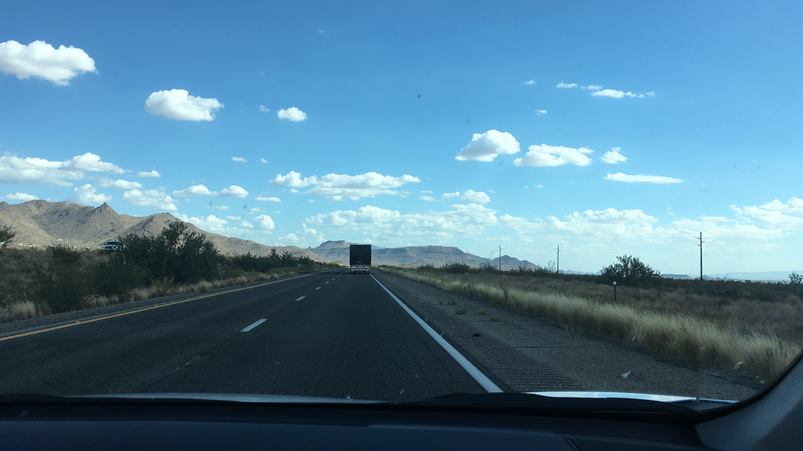

# Let's travel the world! :sunglasses: :notes:

### Project Goal:
I would like to have a quick and easy way to find obscure, yet interesting, places to visit while I'm planning my future trips

### Approach:

1. First things first, find a quality dataset
2. Explore explore explore :mag:
3. Understand the gaps in the data
4. Complement primary dataset with supplementary ones, such as shapefiles and historic tourism data
5. Visualize the data on a map
6. Brainstorm further ideas for use cases
7. To be continue...

### Work notes:

* Convert radian lat/longs to degrees for plotting with folium :white_check_mark:
* Assign each point of interest to a country
* Assign each point of interest to a region or a state
* Assign each point of interest to a city (if applicable)
* Understand missing data points (if any)
* Using NLP and clustering techniques, group the names / links / categories together to define a eventually assign a broader category (e.g. mountains, lakes, famous building, etc.)
